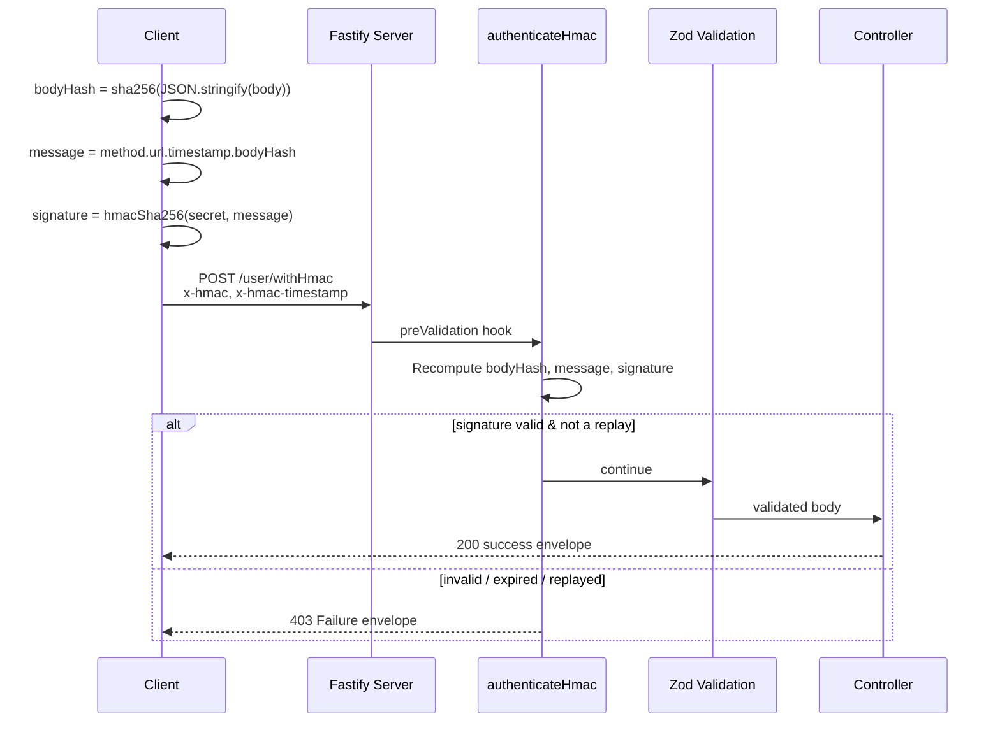

# HMAC Implementation

An enterprise-style HMAC request signing and verification API built with **Fastify**, **TypeScript**, and **Zod**. It provides a clean, well-tested reference implementation of HMAC-SHA256 request authentication that developers can use as a starting point for securing their own APIs.


---

## Overview

**HMAC (Hash-based Message Authentication Code)** is a technique for proving that a request came from someone who holds a shared secret, and that the request wasn't altered in transit. The client computes a signature over the request using a secret key; the server recomputes the same signature independently and compares the two. If they match, the request is authentic and unmodified.

This repository demonstrates a complete, self-contained HMAC-SHA256 request-signing scheme:

- The **client** builds a canonical representation of the request (method, path, timestamp, and a hash of the body), signs it with a shared secret, and sends the signature and timestamp as headers.
- The **server** rebuilds the exact same canonical message from the incoming request, recomputes the signature with the same secret, and rejects the request unless the signatures match using a timing-safe comparison.
- A timestamp check and an in-memory replay cache prevent old or duplicated requests from being reprocessed.

The goal isn't to ship a product — it's to provide a readable, tested reference for the signing/verification recipe itself, so it can be ported into other services.

---

## Features

- **HMAC-SHA256 request signing & verification** ([hmac-api/src/utils/hmac.ts](src/utils/hmac.ts))
- **Canonical message construction** from HTTP method, URL, timestamp, and payload hash
- **Payload hashing** (SHA-256 over the JSON-serialized body)
- **Timestamp validation** with a ±60 second tolerance window
- **Replay protection** via an in-memory cache of previously-verified signatures
- **Timing-safe signature comparison** using `crypto.timingSafeEqual`
- **Zod-based request/response validation** with [fastify-type-provider-zod](https://github.com/turkerdev/fastify-type-provider-zod)
- **Centralized, consistent error handling** with a single JSON response envelope
- **Unauthenticated health check endpoint** for container liveness probes
- **Automated test suite** (unit, integration, and security tests) with Vitest
- **Docker support** with a multi-stage build and a built-in `HEALTHCHECK`
- **Strict TypeScript** configuration throughout

---

## Architecture

```text
Client
  |
  | HTTP request + x-hmac / x-hmac-timestamp headers
  v
Fastify (CORS, JSON body parsing, 10MB body limit)
  |
  v
authenticateHmac (preValidation hook, /user/withHmac only)
  |
  +--> Check headers present & timestamp numeric
  |
  +--> Check timestamp within ±60s tolerance
  |
  +--> Hash body (SHA-256) --> build canonical message --> compute HMAC-SHA256
  |
  +--> Timing-safe compare against client-supplied signature
  |
  +--> Reject if signature was already seen (replay cache)
  |
  v
Zod schema validation (request body)
  |
  v
Controller (echoes payload + request timing)
  |
  v
JSON response envelope
```



---

## How request signing works

The signing recipe lives in [hmac-api/src/utils/hmac.ts](src/utils/hmac.ts) and is intentionally small and dependency-free so it can be re-implemented in any language.

**1. Hash the request body (SHA-256, hex):**

```ts
const bodyHash = crypto.createHash('sha256')
  .update(JSON.stringify(body ?? {}))
  .digest('hex');
```

**2. Build the canonical message** by joining the HTTP method, request path, timestamp, and body hash with `.`:

```ts
const message = `${method}.${url}.${timestamp}.${bodyHash}`;
```

- `method` — the HTTP method, e.g. `POST`
- `url` — the request path as Fastify sees it (e.g. `/user/withHmac`), including any query string
- `timestamp` — the current Unix time in **milliseconds**, as a string
- `bodyHash` — the hash computed in step 1 (a request with no body hashes `{}`)

**3. Sign the canonical message with HMAC-SHA256 (hex), using the shared secret:**

```ts
const signature = crypto.createHmac('sha256', secret)
  .update(message)
  .digest('hex');
```

**4. Send the signature and timestamp as request headers:**

| Header               | Description                                   |
|----------------------|------------------------------------------------|
| `x-hmac`              | The hex-encoded HMAC-SHA256 signature          |
| `x-hmac-timestamp`    | The Unix timestamp (ms) used in the signature  |

Header names are matched case-insensitively (standard HTTP behavior), so `X-Hmac` / `X-Hmac-Timestamp` work identically to the lowercase form.

### How the server verifies a request

[hmac-api/src/middleware/authenticateHmac.ts](src/middleware/authenticateHmac.ts) runs as a `preValidation` hook on protected routes — after the body has been parsed (so it's available to hash) but before Zod validates the body's shape. It:

1. Rejects the request if `x-hmac` or `x-hmac-timestamp` is missing, or the timestamp isn't numeric.
2. Rejects the request if the timestamp is more than **60 seconds** away from the server's current time, in either direction (protects against stale or clock-skewed requests).
3. Recomputes the body hash, canonical message, and expected signature using the server's own `AUTH_SIGNATURE` secret.
4. Rejects the request if the signature length differs, or the signatures don't match under a **timing-safe comparison** (`crypto.timingSafeEqual`), which avoids leaking timing information about how much of the signature was correct.
5. Rejects the request if the exact same (already-verified) signature has been seen before, within a 120-second window — a lightweight in-memory replay guard.

> **Note on replay protection:** the replay cache is a plain in-memory `Map`, scoped to a single process. It is sufficient for a single-instance deployment but will **not** catch replays across multiple horizontally-scaled instances — a production deployment spread across multiple nodes would need a shared store (e.g. Redis) instead.

---

## API Reference

All responses (except `GET /health`) use a consistent envelope:

```json
{
  "statusCode": 200,
  "status": "Success",
  "message": "Request processed successfully with HMAC authentication",
  "response": { "payload": { }, "timing": { } }
}
```

### `GET /health`

Unauthenticated liveness check. Returns the raw payload below (not wrapped in the envelope above) — used by the Dockerfile's `HEALTHCHECK` and can be used by any container orchestrator's liveness probe.

```json
{ "status": "ok" }
```

### `POST /user/withHmac`

Requires a valid `x-hmac` / `x-hmac-timestamp` signature (see [How request signing works](#how-request-signing-works)). Accepts any JSON object as the body (an absent body defaults to `{}`) and echoes it back along with request-timing information.

**Request:**

```http
POST /user/withHmac
Content-Type: application/json
x-hmac: <hex hmac-sha256 signature>
x-hmac-timestamp: <unix ms timestamp>

{ "orderId": "ORD-1001" }
```

**Success response — `200`:**

```json
{
  "statusCode": 200,
  "status": "Success",
  "message": "Request processed successfully with HMAC authentication",
  "response": {
    "payload": { "orderId": "ORD-1001" },
    "timing": {
      "requestReceivedAt": "2026-08-17T10:00:00.000Z",
      "responseSentAt": "2026-08-17T10:00:00.004Z",
      "processingTimeMs": 4.1234
    }
  }
}
```

### `POST /user/withOutHmac`

Identical request/response shape to `/user/withHmac`, but **skips HMAC authentication entirely**. It exists to make the authenticated vs. unauthenticated behavior easy to compare side by side.

### Error responses

Errors share the same envelope shape, with `response` set to `false` (or `[]` for generic/validation failures):

| Scenario                                              | Status | `message`                                          |
|--------------------------------------------------------|:------:|-----------------------------------------------------|
| Missing `x-hmac` / `x-hmac-timestamp`, or non-numeric timestamp | 403    | `Timestamp or Authentication Token Missing`          |
| Timestamp outside the ±60s tolerance window             | 403    | `Request Time expired`                               |
| Signature length mismatch                               | 403    | `Invalid Authentication Signature Length`            |
| Signature does not match                                | 403    | `Invalid Authentication Signature`                   |
| Signature already used (replay)                         | 403    | `Duplicate or replayed request detected`             |
| Request body fails Zod schema validation                | 400    | `Request validation failed`                          |
| Body exceeds the 10MB limit                             | 413    | `Error occurred. Please try again later.`            |
| Unknown route                                           | 404    | `Route not found`                                    |
| Unhandled server error                                  | 500    | `Error occurred. Please try again later.`            |

Note that on `/user/withHmac`, authentication is checked **before** Zod validation — an invalid signature is rejected with 403 even if the body would otherwise fail schema validation too.

---

## Getting started

### Prerequisites

- Node.js `>= 22`
- npm

### Installation

```bash
git clone https://github.com/<your-username>/hmac-implementation.git
cd hmac-implementation
npm install
```

### Configuration

The server reads its configuration from environment variables (via [dotenv](https://www.npmjs.com/package/dotenv) and validated with Zod in [hmac-api/src/config/env.ts](src/config/env.ts)). Create a `.env` file in the project root:

```bash
PORT=5000
AUTH_SIGNATURE=replace-with-a-long-random-secret
```

| Variable         | Required | Default       | Description                                                        |
|------------------|:--------:|---------------|----------------------------------------------------------------------|
| `NODE_ENV`       | No       | `development` | One of `development`, `production`, `test`. Controls log level.     |
| `PORT`           | No       | `5000`        | Port the HTTP server listens on.                                    |
| `AUTH_SIGNATURE` | **Yes**  | —             | The shared HMAC secret used to sign and verify requests.            |

If `AUTH_SIGNATURE` is missing or the environment fails validation, the process logs the error and exits immediately at startup — it will not start with an invalid configuration.

> **Never commit your real `.env` file or secret.** `.env` is already excluded via `.gitignore`.

### Running locally

```bash
# Development, with auto-restart on file changes
npm run dev

# Production build
npm run build
npm start
```

The server binds to `0.0.0.0` on the configured `PORT` (default `5000`).

### Generating a valid HMAC request

Using `curl` requires precomputing the signature first, e.g. with a short Node.js script:

```js
// sign.js
import crypto from 'node:crypto';

const secret = 'replace-with-a-long-random-secret'; // must match AUTH_SIGNATURE
const method = 'POST';
const url = '/user/withHmac';
const body = { orderId: 'ORD-1001' };
const timestamp = Date.now().toString();

const bodyHash = crypto.createHash('sha256').update(JSON.stringify(body)).digest('hex');
const message = `${method}.${url}.${timestamp}.${bodyHash}`;
const signature = crypto.createHmac('sha256', secret).update(message).digest('hex');

console.log({ signature, timestamp });
```

```bash
node sign.js
# => { signature: '...', timestamp: '...' }

curl -X POST http://localhost:5000/user/withHmac \
  -H "Content-Type: application/json" \
  -H "x-hmac: <signature from above>" \
  -H "x-hmac-timestamp: <timestamp from above>" \
  -d '{"orderId":"ORD-1001"}'
```

The signature must be generated **after** the final request body and timestamp are fixed — signing, then modifying the body or waiting too long before sending, will invalidate the signature or trip the timestamp check.

---

## Testing

The test suite uses [Vitest](https://vitest.dev/) and is organized into:

- `tests/unit/` — pure function tests for the hashing/signing primitives, common helpers, and Zod schemas
- `tests/integration/` — end-to-end route behavior (health check, unauthenticated route, error handling)
- `tests/security/` — HMAC-specific behavior: missing/malformed headers, timestamp tolerance, replay protection, header case-insensitivity, and auth-before-validation ordering

```bash
npm test              # run the full suite once
npm run test:watch    # watch mode
npm run test:coverage # run with V8 coverage report
```

Tests run against a fixed test secret (`AUTH_SIGNATURE=test-only-secret-do-not-use-in-production`, configured in [vitest.config.mts](vitest.config.mts)) and use an independent, from-scratch re-implementation of the signing recipe in [tests/helpers/signRequest.ts](tests/helpers/signRequest.ts), so the tests can't pass simply because they share buggy logic with the server.

---

## Running with Docker

The included [Dockerfile](Dockerfile) uses a multi-stage build: dependencies and TypeScript are compiled in a build stage, then only production dependencies and the compiled `dist/` output are copied into the final `node:22-alpine` image, which runs as the non-root `node` user.

```bash
docker build -t hmac-implementation .

docker run -p 5000:5000 \
  -e AUTH_SIGNATURE=replace-with-a-long-random-secret \
  hmac-implementation
```

The image declares a `HEALTHCHECK` that polls `GET /health` every 30 seconds.

---

## Security considerations

- **Use a long, random `AUTH_SIGNATURE`.** It is the only secret protecting request authenticity — treat it like any other credential and rotate it if it may have leaked.
- **Timing-safe comparison:** signatures are compared with `crypto.timingSafeEqual`, not `===`, to avoid leaking information via response-time differences. A length check happens first (required by `timingSafeEqual`, which throws on mismatched buffer lengths), so a length mismatch is reported as a distinct error from a value mismatch.
- **Replay protection is single-instance.** The replay cache is an in-memory `Map`; it resets on restart and isn't shared across multiple server instances. A multi-instance deployment needs a shared store instead.
- **Timestamp tolerance is ±60 seconds.** Clients and servers should keep their clocks reasonably synchronized (e.g. via NTP); large clock drift will cause valid requests to be rejected.
- **Sensitive headers are redacted from logs.** `x-hmac`, `x-hmac-timestamp`, and `authorization` are stripped from Fastify's request logs (see [hmac-api/src/app.ts](src/app.ts)).
- **Always serve this over HTTPS in production.** HMAC authenticates and protects the integrity of a request, but does not provide confidentiality — without TLS, headers and body are still visible to anyone on the network path.
- **This repository has no license file yet.** If you intend to reuse this code, add a `LICENSE` file to the repository to state the terms explicitly.

---

## Project structure

```text
src/
  app.ts                     # Fastify app factory: plugins, error handler, route registration
  server.ts                  # Process entrypoint: starts the server, handles graceful shutdown
  config/
    env.ts                   # Zod-validated environment configuration
  routes/
    index.ts                 # Registers all route plugins
    health/healthRouter.ts   # GET /health
    user/userRouter.ts       # POST /user/withHmac, POST /user/withOutHmac
  controller/
    user/userController.ts   # Route handlers
  middleware/
    authenticateHmac.ts      # HMAC verification hook
    errorHandler.ts          # Centralized error -> response envelope mapping
    requestTimer.ts          # Captures request-arrival time for timing metadata
  schemas/
    user/userSchema.ts       # Zod request/response schemas
  utils/
    hmac.ts                  # Signing/verification primitives (hash, canonical message, sign)
    commonFunction.ts        # Response envelope + request timing helpers
    constants.ts             # Shared status codes/messages
  types/
    fastify.d.ts             # Fastify request type augmentation
tests/
  unit/                      # Pure function tests
  integration/                # End-to-end route tests
  security/                   # HMAC-specific behavior tests
  helpers/signRequest.ts      # Independent client-side signing implementation used by tests
```

---

## Contributing

Contributions are welcome. If you'd like to propose a change:

1. Fork the repository and create a feature branch.
2. Make your changes, keeping the existing code style (see `tsconfig.json`'s `strict` settings).
3. Add or update tests under `tests/` for any behavior change — the security-relevant behaviors in `authenticateHmac.ts` are especially test-sensitive.
4. Run `npm test` and `npm run build` locally before opening a pull request.
5. Open a pull request describing the change and the reasoning behind it.

For substantial changes, please open an issue first to discuss the approach.
